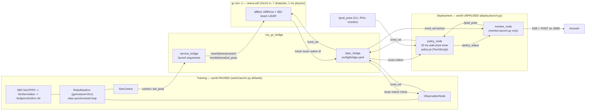

# ros2-rl-nav

A differential-drive robot in Gazebo Harmonic, exposed as a Gymnasium environment
over ROS 2 Jazzy, trained with SAC/PPO, and redeployed as a standalone ROS 2
inference node — then measured to find out what redeployment cost.

> **Status: Phases 0–2, 4 and 6 built and verified; Phase 3 built but not yet
> run.** Simulation, bridge, the Gym environment, the training stack, the
> TorchScript export, the deployment node, the live monitor and the gap harness
> all exist, are tested, and have been smoke-run end to end against a live
> Gazebo. What has **not** happened is a real training run — so the results
> tables below are deliberately empty rather than aspirational.

---

## Why this matters

Gym's `step()` is synchronous and blocking. ROS 2 and Gazebo are asynchronous and
free-running. The obvious way to bolt them together — subscribe to `/scan`,
publish `/cmd_vel`, sleep — gives you observations that are stale by a *variable*
amount and an effective action duration that jitters with CPU load. The policy
then learns a controller for a simulator that does not exist: training appears to
work, the policy fails on redeployment, and nothing in the logs says why.

That failure is not hypothetical or specific to this arena. It is the standard
shape of a sim-to-real gap in a learned controller, and it is usually reported as
an anecdote ("it worked in sim") because nothing in the setup makes the
difference *attributable*. This project is built to make it attributable:

- **Training** owns the clock. The world is paused by default and each `step()`
  advances it by exactly 50 ms, so episodes are reproducible for a fixed seed and
  throughput is decoupled from wall-clock speed.
- **Deployment** does not. `policy_node` runs a 20 Hz wall-clock timer against an
  unpaused world, reads the newest sample whatever its age, and has a watchdog —
  exactly what a real robot does.
- The two loops differ in **exactly one** respect: who controls when the world
  advances. Same observation assembly, same action scaling, same goal tolerance,
  same collision threshold, same 500-step limit — shared code, not parallel
  implementations.

So the delta between the step-synchronized score and the free-running score is a
measurement of that one design choice, not of an accumulation of small
divergences. `scripts/verify_phase1.sh` proves the stepping mechanism empirically
— that 50 sim iterations advance `/clock` by exactly 50 ms — before any RL code
exists, and `deploy_eval.py` measures the cost afterwards.

---

## Skills demonstrated

Every row points at the code that demonstrates it, because a list of technologies
is worth nothing on its own — the interesting question is always *which specific
problem in that technology was solved, and how*.

| Area | The specific problem, and where it is solved |
|---|---|
| **ROS 2 (Jazzy)** | Concurrency, not tutorials: a `MultiThreadedExecutor` with `ReentrantCallbackGroup`/`MutuallyExclusiveCallbackGroup` so a blocking service call inside a callback cannot deadlock the node, and so two 20 Hz timer ticks cannot overlap on shared episode state — `observation_node.py`, `sim_control.py`, `policy_node.py`. Launch files with arguments and `IncludeLaunchDescription`, node parameters, sensor QoS, `use_sim_time` set per-node and on purpose |
| **Gazebo Harmonic** | The current `gz-sim` API, not Gazebo Classic: `ControlWorld` for stepping, `SetEntityPose` for teleporting, an SDF world and robot model authored by hand — `worlds/arena.sdf`, `models/diffbot/model.sdf` |
| **The ROS ↔ sim boundary** | `ros_gz_bridge` topic *and* service mapping (`config/bridge.yaml` for topics, explicit arguments in `world.launch.py` for services), and the fact that a misconfigured bridge produces **silence rather than an error** — hence `scripts/verify_phase1.sh`, which turns each silent failure into a printed FAIL |
| **Robotics fundamentals** | Frames done explicitly: world vs `odom`, a body-frame goal bearing, quaternion → yaw, angle wrapping, dead-reckoned drift left *visible* in the monitor and the GIF rather than corrected away with ground truth — `env.py`, `monitor.py`, `record.py` |
| **Sensor processing** | **Min**-pooling 360 beams to 20, because mean-pooling averages a chair leg into free space and the policy drives into it. NaN/±inf mapped before clipping, not after — `observation.py` |
| **Reinforcement learning** | Gymnasium `Env` written against `check_env`, SAC and PPO via Stable-Baselines3, `VecNormalize`, `SubprocVecEnv` over N isolated simulators, a held-out eval set, a goal-distance curriculum, and reward shaping designed against specific hacks — `env.py`, `train.py`, `hyperparams.py`, `callbacks.py` |
| **RL methodology** | Three seeds minimum, mean ± std, a fixed eval set generated from a seed training never uses, and *timeout* rate reported alongside collision rate — because a policy that learns to stand still looks safe on every other metric. `eval_set.py`, `report.py` |
| **Sim-to-real reasoning** | A step-synchronized trainer and a free-running deployment differing in exactly one respect, so the difference between them is attributable. Measured, not asserted — `deploy_eval.py` |
| **Deployment / inference** | TorchScript export with the traced graph verified against `model.predict` over the observation box *before anything is written*, so no SB3 on the robot — `export_policy.py` |
| **Safety engineering** | A hard stop (0.15 m) and a 200 ms watchdog that sit **upstream** of the episode logic, not downstream of it, and are pure functions with unit tests — `deploy.py` |
| **Real-time systems** | Observation staleness measured (mean/p95/max), watchdog misses counted, and the real-time-factor confound in the headline number reported rather than buried — `policy_node.py`, `deploy_eval.py` |
| **Architecture** | "Pure core, ROS shell": every piece of arithmetic lives in a ROS-free module that runs on a Windows laptop in milliseconds, and the ROS layer only moves messages. That is why the bulk of the suite runs without a simulator |
| **Web / observability** | An SSE telemetry stream and a click-to-set-goal page on the Python standard library only — no bundler, no CDN, no vendored JS — with all geometry computed server-side so the browser cannot become a second implementation. `monitor.py`, `monitor_server.py`, `web/` |
| **Testing** | 18 test modules: property tests over the contract, SDF-vs-constants cross-checks that catch a world edited out from under the code, `sim`-marked integration tests, and PASS/FAIL verification scripts per phase |
| **Infrastructure** | A reproducible ROS 2 + Gazebo image, one-command training via compose, and two-tier CI — a Docker-free fast path for the pure core, plus the full image where `rclpy`, torch and SB3 coexist |

**Languages and tools:** Python 3.12, SDF/XML, YAML, Bash, Make, Dockerfile,
JavaScript/HTML/CSS (monitor page), Markdown. ROS 2 Jazzy · Gazebo Harmonic
(`gz sim`) · `ros_gz_bridge` · Gymnasium · Stable-Baselines3 ≥ 2.3 · PyTorch 2.4
(CPU) · NumPy · TensorBoard · Matplotlib (Agg) · pytest · ruff · colcon/ament ·
Docker Compose · GitHub Actions. CycloneDDS is pinned as the RMW.

---

## Architecture

### Models

**Policy and value networks** (`hyperparams.py`). SB3 `MlpPolicy`, hidden layers
`[256, 256]`, deliberately identical for SAC and PPO so the comparison measures
the algorithm rather than capacity. No CNN (there is no image) and no recurrence
(the observation already carries the previous action and the step fraction).

| | SAC | PPO |
|---|---|---|
| Budget | 150k timesteps | 500k timesteps (on-policy; equal budgets would measure sample efficiency) |
| Networks | actor + twin critics, `[256, 256]` | `pi` and `vf` heads, both `[256, 256]` |
| Key knobs | `lr 3e-4`, buffer 200k, `learning_starts` 5k, batch 512, `tau` 0.005, `gamma` 0.99, `gradient_steps` 2, `ent_coef="auto"` | `lr 3e-4`, `n_steps` 512/env, batch 256, 10 epochs, `gamma` 0.99, `gae_lambda` 0.95, `clip_range` 0.2, `ent_coef` 0.0 |

`VecNormalize` normalizes **reward only** (`clip_reward=10.0`). Observation
normalization is off and load-bearing: running obs statistics would become a
second preprocessing path that `policy_node` would have to reproduce, which is
exactly the training/inference divergence the shared-code rule forbids.

A goal-distance curriculum starts at 2.0 m and expands by 1.0 m each time the
rolling success rate over 20 episodes crosses 70%, capped at the evaluation set's
maximum distance (`callbacks.CurriculumCallback`).

**Observation space** — `Box(-1, 1, (26,), float32)`:

| Index | Content | Normalization |
|---|---|---|
| 0–19 | 360 `/scan` beams min-pooled into 20 blocks of 18 | `2·(r/10.0) − 1` |
| 20 | Goal distance | `2·clip(d/14.15, 0, 1) − 1` (arena diagonal) |
| 21–22 | Goal bearing sin/cos, robot body frame | already in [−1, 1] |
| 23–24 | Previous action | already in [−1, 1] |
| 25 | Step fraction | `2·(t/500) − 1` |

**Action space** — `Box(-1, 1, (2,), float32)`, scaled to a
`geometry_msgs/Twist`: `v = 0.4·(a₀+1)/2` → **[0, 0.4] m/s** (no reversing, by
design), `ω = 1.5·a₁` → **[−1.5, 1.5] rad/s**.

**Reward** — `(d_prev − d_curr) − 0.01 − 0.05·|ω| + 10 (goal) − 10 (collision)`.
Terminates on goal within 0.25 m or pooled min-LiDAR < 0.18 m; truncates at 500
steps. Full detail, including the anti-reward-hacking escalation ladder and the
reset/determinism specification, is in [`CONTRACTS.md`](CONTRACTS.md) — the
authoritative document, transcribed once into `contract.py`.

**Data models.** `deploy.Command` / `deploy.Outcome` / `deploy.TickStatistics`
(the pure deployment core), `arena.Box` / `arena.Cylinder` (obstacle geometry,
cross-checked against the SDF by `test_arena.py`), the `info` dict contract
(`distance_to_goal`, `min_lidar`, `sim_time`, `is_success`, `collided`), and
per-run JSON artifacts `eval.json` / `gap.json` that `report.py` aggregates.

### Node and topic graph



The two control loops, side by side:

```
TRAINING (paused world)                  DEPLOYMENT (free-running world)
1. publish /cmd_vel                      1. 20 Hz wall-clock timer fires
2. ControlWorld(multi_step=50) -> 50 ms  2. read NEWEST sample, whatever its age
3. BLOCK until stamp >= target sim time  3. watchdog (200 ms) / safety gate (0.15 m)
4. assemble_observation()                4. assemble_observation()   <- same function
```

### Layout

```
ros2-rl-nav/
├── CONTRACTS.md              Authoritative RL interface spec — obs, action, reward,
│                             termination, reset, determinism bounds
├── CLAUDE.md                 Stack pins, the step-sync rationale, ways this fails
├── WORKPLAN.md               The phases and their exit criteria
├── Makefile                  Every command below; wraps docker compose
├── pyproject.toml            pytest + ruff config (the ROS package is built by ament)
├── docker/
│   ├── Dockerfile            ros:jazzy-ros-base + ros-gz + CPU torch + SB3
│   ├── docker-compose.yml    services: dev, test, verify, verify2, train,
│   │                         deploy, verify6, monitor
│   └── entrypoint.sh         sources /opt/ros/jazzy/setup.bash, then /ws overlay
├── scripts/
│   ├── verify_phase1.sh      bridge/stepping verification, PASS/FAIL per check
│   ├── verify_phase2.sh      env exit criteria: episodes, throughput, memory
│   ├── phase2_checks.py      timing checks against an analytic prediction
│   ├── verify_phase4.sh      smoke: train tiny -> export -> free-running eval
│   └── verify_phase6.sh      smoke: the monitor serves, streams and steers
└── src/robot_rl_env/         the ament_python package
    ├── package.xml, setup.py, setup.cfg
    ├── config/bridge.yaml    ros_gz_bridge topic mapping
    ├── worlds/arena.sdf      10x10 m arena, 7 obstacles, 1 ms physics
    ├── models/diffbot/       hand-authored SDF robot: DiffDrive + 360-beam LiDAR
    ├── launch/
    │   ├── world.launch.py   gz server + topic bridge + service bridge
    │   ├── deploy.launch.py  world (unpaused) + policy_node
    │   └── monitor.launch.py deploy.launch.py + monitor_node
    ├── web/                  index.html, style.css, app.js — the monitor page
    ├── test/                 18 pytest modules; `sim`-marked ones need Gazebo
    └── robot_rl_env/
        ├── contract.py       every contract number, transcribed once
        ├── observation.py    the 26-vector assembly — PURE, shared by both sides
        ├── action.py         action -> (v, omega) — PURE, shared for the same reason
        ├── arena.py          obstacle geometry + reset rejection sampling — pure
        ├── env.py            RobotNavEnv(gymnasium.Env), the step-synchronized loop
        ├── observation_node.py, sim_control.py   the ROS shell around the env
        ├── sim_launcher.py   one gz server + bridges per worker, partitioned
        ├── vec_env.py        SubprocVecEnv construction and simulator lifetime
        ├── hyperparams.py    SAC/PPO config and every run-shaping constant
        ├── callbacks.py      curriculum + success-rate callbacks
        ├── train.py          Phase 3 entry point
        ├── eval_set.py       held-out episodes from a seed training never uses
        ├── evaluate.py       step-synchronized scoring -> eval.json
        ├── export_policy.py  SB3 .zip -> TorchScript .pt, verified before writing
        ├── deploy.py         deployment controller: watchdog, safety gate — pure
        ├── policy_node.py    the ROS 2 inference node
        ├── deploy_eval.py    the gap measurement -> gap.json
        ├── monitor.py        every monitor payload — pure, the only geometry
        ├── monitor_server.py page + SSE stream + goal POST, stdlib only
        ├── monitor_node.py   the monitor's ROS end
        ├── record.py         one scored episode as a top-down GIF
        └── report.py         seed aggregation; splices the tables into this README
```

---

## How it works

**1. The world comes up.** `world.launch.py` starts `gz sim -s` on
`worlds/arena.sdf` — headless and **paused** by default — plus two
`ros_gz_bridge` nodes: a topic bridge (`/clock`, `/scan`, `/odom`, `/tf` out;
`/cmd_vel` in) and a service bridge for `/world/arena/control` and
`/world/arena/set_pose`. Both services come from the world's
`gz-sim-user-commands-system` plugin; without them nothing can step or teleport.

**2. `reset()` places an episode.** `arena.py` rejection-samples a start pose and
a goal in free space (≥0.4 m clearance, ≥1.0 m apart), optionally capped by the
curriculum radius. The robot is brought to rest by commanding zero velocity and
advancing 1000 physics iterations — *not* by `ControlWorld(reset.all)`, which was
measured to swallow the following teleport about half the time and to wedge the
server under repeated use. Then `set_pose` teleports it and one more sim step
lands the pose and produces the first scan.

**3. `step()` owns the clock.** Publish the scaled action to `/cmd_vel`; call
`ControlWorld(multi_step=50)` to advance exactly 50 iterations × 1 ms; **block**
until `/scan` and `/odom` report a stamp ≥ the target sim time (accumulated in
integer nanoseconds, never float seconds); assemble the 26-vector; compute the
reward from the distance before and after. Every step advances `/clock` by
exactly 50 ms — a tested invariant. If a fresh observation does not arrive within
5 s the env **raises**; it never returns a cached one.

**4. Training runs N of those in parallel.** `sim_launcher.py` gives each
`SubprocVecEnv` worker its own `gz sim` process and bridges, isolated by a
distinct `ROS_DOMAIN_ID` *and* `GZ_PARTITION` — DDS and gz-transport are separate
transports and partitioning only one leaves the workers sharing a `/cmd_vel`. A
`SimulatorLifetime` wrapper kills the simulator when SB3 closes the env, because
an orphaned server would let the next run attach to a world still carrying the
previous run's robot. Around that: `VecNormalize` (reward only), the curriculum
callback, an `EvalCallback` on the held-out set, and periodic checkpoints. Each
run writes `runs/<algo>-seed<N>/` containing `tensorboard/`, `checkpoints/`,
`best/`, `final.zip`, `vecnormalize.pkl` and `config.txt`.

**5. Evaluation is a measurement, not a sample.** `eval_set.py` generates a fixed
set of episodes from a seed training never uses, with goals capped at a distance
reachable inside 500 steps at 0.4 m/s. `evaluate.py` replays that same set for
every run and writes `eval.json` with success, collision **and timeout** rates —
the third number is what exposes a policy that learned to stand still.

**6. Export drops SB3.** `export_policy.py` wraps the trained actor in a small
`torch.nn.Module`, traces it to TorchScript, and compares the traced output
against `model.predict` over samples from the observation box. It refuses to
write `policy.pt` if they disagree — so the robot needs only torch.

**7. Deployment lets go of the clock.** `deploy.launch.py` relaunches the same
world with `paused:=false` and starts `policy_node`, whose `use_sim_time` is
deliberately **false**: it stands in for something on a robot, where the only
clock is the wall clock. A 20 Hz timer fires, the node reads whatever the newest
`/scan`/`/odom` sample is, and `deploy.DeploymentController` — pure, unit-tested —
applies the watchdog (zero `/cmd_vel` if nothing arrived within 200 ms) and the
0.15 m hard stop *upstream* of the episode logic, then runs the policy through
the **same** `assemble_observation` and `scale_action` the trainer used. Goals
arrive on `/goal_pose` in the `odom` frame; a goal in the wrong frame is rejected
rather than obeyed.

**8. The gap gets measured.** `deploy_eval.py` builds that same `policy_node` (it
does not reimplement the loop) and scores the exported policy on the *same*
held-out episodes with the *same* termination rules, against the unpaused world.
It prints free-running vs step-synchronized side by side, writes `gap.json`, and
reports observation-age statistics, watchdog misses and the achieved real-time
factor — warning explicitly when the factor strays more than 10% from 1, because
that confound is part of any number taken on a slow host.

---

## How to run

### Prerequisites

Docker (Desktop on Windows/macOS, Engine on Linux) with Compose v2, GNU Make, and
~15 GB of disk for the image. Nothing else is installed on the host — ROS 2
Jazzy, Gazebo Harmonic, torch and SB3 all live in the image. Development here is
Windows 11 + Docker Desktop, headless; there is no GPU and torch is the CPU
build. All services bind-mount the repo at `/ws`, so a Python edit on the host is
live in the container without a rebuild.

```bash
make build     # build the ROS 2 Jazzy + Gazebo Harmonic image (ros2-rl-nav:jazzy)
make help      # every target, one line each
```

### Verify the stack

```bash
make verify                  # Phase 1: bridge + stepping, PASS/FAIL per check
make verify2                 # Phase 2 exit criteria (make verify2 EPISODES=25 to shorten)
make verify4                 # Phase 4 smoke: train tiny, export, free-running eval
                             #   make verify4 TIMESTEPS=300 EPISODES4=2
make verify6                 # Phase 6 smoke: the monitor serves, streams and steers
                             #   needs a policy — run make verify4 first
make test                    # colcon build + pytest, headless (this is what CI runs)
make lint                    # ruff check src scripts
make shell                   # interactive container shell, repo at /ws
make world                   # launch the arena headless and paused, for manual poking
make clean                   # remove build/ install/ log/
```

### The full pipeline

```bash
make train ALGO=sac SEED=0 ENVS=4                              # hours; run it yourself
make evaluate MODEL=runs/sac-seed0/best/best_model.zip         # step-synchronized score
make export-policy MODEL=runs/sac-seed0/best/best_model.zip    # -> runs/sac-seed0/policy.pt
make gap                                                       # free-running score + delta
make report                                                    # aggregate seeds -> the tables below
make gif MODEL=runs/sac-seed0/best/best_model.zip              # one episode as a GIF
make deploy POLICY=runs/sac-seed0/policy.pt                    # drive it interactively
make monitor POLICY=runs/sac-seed0/policy.pt                   # ...and watch it on :8080
make board                                                     # TensorBoard on :6006
```

`ALGO` (default `sac`), `SEED` (`0`) and `ENVS` (`4`) also set the defaults for
`MODEL` (`runs/$(ALGO)-seed$(SEED)/best/best_model.zip`) and `POLICY`
(`runs/$(ALGO)-seed$(SEED)/policy.pt`), and select which run `evaluate`, `gap`
and `report` read and write. Other variables: `EPISODES` (verify2, default 100),
`TIMESTEPS`/`EPISODES4` (verify4, 300/2), `EPISODE` and `GIF` (gif, `0` and
`docs/nav.gif`), `MONITOR_PORT` (monitor, 8080).

`make gap` requires `make evaluate` to have run on the same run directory, so
there is a baseline to subtract. `make export-policy` is named that way because
`export` is a GNU make directive.

To reproduce a default training run without Make:

```bash
docker compose -f docker/docker-compose.yml up train
```

### Launch files directly

Inside the container (`make shell`), after `colcon build --symlink-install &&
source install/setup.bash`:

```bash
ros2 launch robot_rl_env world.launch.py                    # headless, paused (training defaults)
ros2 launch robot_rl_env world.launch.py headless:=false    # with the Gazebo GUI
ros2 launch robot_rl_env world.launch.py paused:=false      # free-running
ros2 launch robot_rl_env deploy.launch.py policy:=runs/sac-seed0/policy.pt
ros2 launch robot_rl_env monitor.launch.py policy:=runs/sac-seed0/policy.pt
```

`deploy.launch.py` takes `policy` (required), `headless` (`true`), `goal_topic`
(`/goal_pose`) and `status_topic` (empty — off, so the gap measurement runs the
same code path as an unwatched deployment). `monitor.launch.py` adds `host`
(`0.0.0.0`), `port` (`8080`) and sets `status_topic` to `/policy_status`.

Send a goal by hand while `make deploy` is running, from a second `make shell`:

```bash
ros2 topic pub --once /goal_pose geometry_msgs/msg/PoseStamped \
  '{header: {frame_id: odom}, pose: {position: {x: 2.0, y: 1.0}}}'
```

### Python entry points

Also runnable directly inside the container:

```bash
python3 -m robot_rl_env.train --algo sac --seed 0 --n-envs 4
python3 -m robot_rl_env.evaluate --model <path.zip> --json <out.json>
python3 -m robot_rl_env.export_policy --model <path.zip>
python3 -m robot_rl_env.deploy_eval --policy <path.pt> --baseline <eval.json> --json <gap.json>
python3 -m robot_rl_env.record --model <path.zip> --episode 0 --out docs/nav.gif
python3 -m robot_rl_env.report            # pure arithmetic — runs on the host too
```

### Environment variables

Set by `docker/docker-compose.yml` and the Dockerfile; override only if you know
why.

| Variable | Value | Why |
|---|---|---|
| `ROS_DOMAIN_ID` | `42` | DDS partition. Training workers get one each via `sim_launcher.py` |
| `GZ_PARTITION` | per worker | gz-transport is a *separate* transport from DDS; partitioning only one is a silent cross-talk bug |
| `RMW_IMPLEMENTATION` | `rmw_cyclonedds_cpp` | FastDDS shared memory is unreliable on Docker Desktop's WSL2 backing store |
| `QT_QPA_PLATFORM` | `offscreen` | headless by default |
| `GZ_SIM_RESOURCE_PATH` | models + worlds | so `model://diffbot` resolves |
| `POLICY` | `runs/sac-seed0/policy.pt` | consumed by the `deploy` and `monitor` compose services |
| `MONITOR_PORT` | `8080` | host-side port for `make monitor`, bound to `127.0.0.1` |

The monitor's port publish is the whole access control — its POST route sets a
robot goal and has no authentication in front of it — which is why compose binds
it to loopback rather than every interface.

---

## Watching one, live

```bash
make monitor POLICY=runs/sac-seed0/policy.pt   # then open http://localhost:8080
```

The same free-running deployment as `make deploy`, with a browser window onto it:
the arena, the robot's dead-reckoned pose, the **20 min-pooled LiDAR sectors the
policy receives** — not the 360 raw beams — the commanded velocities, and the
observation age beside the fixed 50 ms training saw. Click anywhere free to
publish a goal on `/goal_pose`.

Three decisions are worth naming, because each has an easier alternative that
would quietly make the view dishonest.

**The browser gets no geometry.** No pooling, no beam angles, no quaternions, no
odom→world transform in `app.js`. It plots world-frame line segments handed to it
by `monitor.py`, which reads the scan through the same `ObservationAssembler` the
policy does. The whole project's defence against training/inference divergence is
that there is only one implementation of the observation; adding a second one in
JavaScript — where nobody would think to look — would give that up for a nicer
render loop.

**The pose is dead-reckoned, not ground truth.** Gazebo knows exactly where the
robot is and the monitor deliberately does not ask. It seeds the transform at the
spawn pose and integrates odometry, as a deployed robot must. So the drawn robot
slides off the drawn obstacles as odometry drifts — which is the error the policy
is navigating on, shown rather than corrected away.

**The measurement is not watched.** `make gap` launches `deploy.launch.py`; this
is `monitor.launch.py`. The policy node's status topic defaults to off and
`deploy_eval` never turns it on. An HTTP server, a browser and 20 JSON frames a
second, on a container already at RTF 0.3–0.5, would land in the gap number
instead of in the picture. Watch a run here; measure a run there.

No build step, no bundler, no CDN, no vendored JS: one HTML file, one CSS file,
one script, served by `http.server` from the standard library. `make verify6`
checks all of it in text — the scene, the page, pooled sectors on the stream, a
goal outside the arena refused, and a goal that reached the controller.

---

## Results

No training run has been executed yet. This table gets filled with mean ± std
over **three seeds per algorithm** — single-seed RL numbers aren't worth
reporting.

The table below is generated, not typed: `make report` reads every
`runs/<algo>-seed<N>/eval.json` and splices the aggregate back in between the
markers. Nobody transcribes a success rate by hand into a README, and nobody
notices when a transcription is stale.

<!-- BEGIN RESULTS -->
| Algorithm | Success rate | Mean path length | Path efficiency | Collision rate | Timeout rate |
|---|---|---|---|---|---|
| SAC | — | — | — | — | — |
| PPO | — | — | — | — | — |

> No scored run found under `runs/`. Run `make train` and then `make evaluate`;
> this table is regenerated by `make report`.
<!-- END RESULTS -->

### Sim-to-deployment gap

The harness is built and smoke-tested; the numbers wait on Phase 3.

<!-- BEGIN GAP -->
|  | Step-synchronized | Free-running | Δ |
|---|---|---|---|
| Success rate | — | — | — |
| Collision rate | — | — | — |
| Timeout rate | — | — | — |

> No run has both `eval.json` and `gap.json`. Run `make evaluate` and then
> `make gap` on the same run.
<!-- END GAP -->

**The mechanism is already measurable without a trained policy**, and it is the
more interesting half. From a smoke run in this container:

| | Training | Deployment (measured) |
|---|---|---|
| Observation age | 50 ms, fixed, by construction | 121 ms mean, 183 ms p95, 243 ms max |
| Ticks losing the observation entirely | 0 | 2.1% (past the 200 ms watchdog) |

The policy trained on a world that handed it a 50 ms-old observation every single
step. Deployed, it gets one two to four times older, varying tick to tick, and a
fiftieth of the time gets nothing usable at all and is stopped by the watchdog.
That is the gap's mechanism, and it is a property of the architecture rather than
of any policy.

**One caveat, reported rather than buried.** This container sustains a real-time
factor of ~0.3–0.5. The node ticks at 20 Hz on a wall clock, as a robot would, so
a run at RTF 0.3 controls the world at ~65 Hz of *sim* time against the 20 Hz it
trained at — a difference in the control problem, not in staleness, and the two
are not separable from the numbers above. `deploy_eval.py` computes this and says
so in as many words whenever the factor strays more than 10% from 1. A headline
gap taken on this machine would be part architecture and part hardware; taking it
on a machine that sustains RTF ≈ 1 is the remaining work.

---

## What's left

- Run training. Three seeds × two algorithms, then `make report` — the tables
  above fill themselves from the per-run JSON.
- Take the gap measurement on a host that sustains a real-time factor near 1.
- A GIF of a trained policy in the first 100 px of this README. The recorder is
  built and tested (`make gif`); there is no trained policy yet, so there is
  nothing honest to record. The same blocker applies to a screenshot of the live
  monitor: it currently shows a policy that has seen 300 training steps.

## License

MIT
